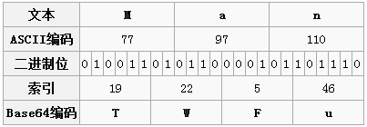

#24.Java加密解密之Base64

##24.1 Base64
在计算中，字节（byte）是最小的计量单元。ASCII编码使用一个字节对数据进行编码，共可容纳2^8=256个字符。然而在ASCII编码的256个字符当中，有很多字符都是不可打印、对人不可见的。例如空字符、响铃、退格等等字符。如果要让数据的二进制对人可见，可以将二进制转为二进制、八进制或十六进制的字符串表示，不足的是，这些字符串表示都会占用大量计算机存储空间。

当然，还有一种选择那就是使用**Base64**编码。Base64是一种基于64个可打印字符（**[A-Za-z0-9+/]**）来表示二进制数据的表示方法。

Base64基于64个可打印字符，所以每一个Base64编码单元只需要log2(64) = 6个位元。而计算机的计量单元是8个位元，6与8的最小公倍数是24，所以可以使用24个位元（也就是三个字节）作为一个编码处理单元。该编码处理单元规则如下：

 * 第1个字节的前6个位元作为Base64编码的第1个编码单元；
 * 第1个字节的后2个位元和第2个字节的前4位作为Base64编码的第2个编码单元；
 * 第2个字节的后4个位元和第3个字节的后4位作为Base64编码的第3个编码单元；
 * 第3个字节的后6个位元作为Base64编码的第4个编码单元。

引用维基百科的例子：<br>


##24.2 补足空缺位元

在Base64编码中，是以24个位元（3个字节）作为一个编码处理单元的，那就可能出现提供的位元不足3个字节（缺1个或2个字节）。处理方法如下：
* 如果缺**1**个字节，使用0来填充，在Base64编码结果后面加**1**个**=**来说明填充了**1**个字节；
* 如果缺**2**个字节，使用0来填充，在Base64编码结果后面加**2**个**=**来指明填充了**2**个字节；
* 后面全部由0填充所产生的字符都需要进行删除。如果填充了1个字节0，则需要删除Base64字符序列（未填充"="前）的最后一个字符(000000对应的字符是A)；如果填充了2个字节0，则需要删除Base64字符序列（未填充"="前）的最后两个字符（实际上该字符是A）。

## 24.3 代码实现

由于CPU最下的处理单元是字节，所以要将数据转为基于6个位元为一个编码单元的Base64编码，则需要将这6个位元转为可以处理的8个位元（1个字节）进行处理。所以需要采用位操作。

```Java
import java.io.UnsupportedEncodingException;
import org.junit.Test;

public class Base64Test {

	@Test
	public void t1_encode() throws UnsupportedEncodingException {
		String text = "HelloWorld!";
		System.out.println(base64Encode(text.getBytes("ASCII"))); // SGVsbG9Xb3JsZCE=
	}

	public static String base64Encode(byte[] data) {
		int len = data.length;
		int paddingLen = 3 - (len % 3 == 0 ? 3 : len % 3); // 填充字节数

		StringBuilder dest = new StringBuilder();
		for (int i = 0; i < len - paddingLen - 1;) {
			handleUnit(data[i++], data[i++], data[i++], dest);
		}
		if (paddingLen != 0) { // 处理填充
			handlePadding(data, len, paddingLen, dest);
		}

		return dest.toString();
	}

	/**
	 * Base64编码处理单元
	 */
	public static void handleUnit(byte b1, byte b2, byte b3, StringBuilder dest) {
		dest.append(BASE64_DIGITS[b1 >>> 2]);
		dest.append(BASE64_DIGITS[(b1 << 4 | b2 >>> 4) & 0x3f]);
		dest.append(BASE64_DIGITS[(b2 << 2 | b3 >>> 6) & 0x3f]);
		dest.append(BASE64_DIGITS[b3 & 0x3f]);
	}

	public static void handlePadding(byte[] data, int len, int paddingLen, StringBuilder dest) {
		if (paddingLen == 1) {
			handleUnit(data[len - len % 3], data[len - len % 3 + 1], (byte) 0x00, dest);
		}

		if (paddingLen == 2) {
			handleUnit(data[len - len % 3], (byte) 0x00, (byte) 0x00, dest);
		}

		dest.setLength(dest.length() - paddingLen); // 删除由0填充产生的字符

		for (int j = 0; j < paddingLen; j++) { // 填充"="
			dest.append("=");
		}
	}

	private static final char[] BASE64_DIGITS = { 'A', 'B', 'C', 'D', 'E', 'F', 'G', 'H', 'I', 'J', 'K', 'L', 'M', 'N',
			'O', 'P', 'Q', 'R', 'S', 'T', 'U', 'V', 'W', 'X', 'Y', 'Z', 'a', 'b', 'c', 'd', 'e', 'f', 'g', 'h', 'i',
			'j', 'k', 'l', 'm', 'n', 'o', 'p', 'q', 'r', 's', 't', 'u', 'v', 'w', 'x', 'y', 'z', '0', '1', '2', '3',
			'4', '5', '6', '7', '8', '9', '+', '/' };
}
```

##24.4 参考资料
* http://zh.wikipedia.org/zh/Base64