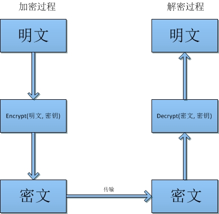

#26.Java加密解密之基本流程

抽象层次看待**加解解密流程**，其实很简单：加密算法按照一定的算法逻辑将明文转化为密文，而解密算法则是按照算法逻辑将密文转化为明文。

这里所说的**算法逻辑**由**算法**和**密钥**共同决定。

**算法**：加密过程的逻辑运算过程。
**密钥**：加密过程的编码参照数据。

过程如下：

1. 加密算法根据密钥对明文进行加密形成密文；
2. 解密算法根据密钥对密文进行机密得到明文；

Base64的编码解密类似于加密解密的过程（实际上编码解码与加密解密的关系暧昧非常），把Base64看做加密算法，而64个可打印字符是密钥，Base64的编码过程可以理解为加密过程，而解码过程称之为解密。

## 密码体系类别

在计算机领域，我们尝试用的都是基于密钥的密码系统，基于密钥的密码体系分为两种：

### 对称密码体系

**对称密码体系**，加密和解密双方都使用同一套密钥，例如Base64的64个打印字符序列，如果加密和解密使用的字符不一致，自然无法完成解密过程。对于对称密码体系，一旦密钥泄露了，密文自然就会别破解（当然，只局限于公开的密码算法）。

### 非对称密码体系

**非对称密码体系**，加密和解密双方使用不同的密钥。一个密钥公开，称为**公钥**；另一个密钥保密，称为**私钥**。用公钥加密的密文只有对应私钥才能解密，而用私钥加密的密文只有对应的公钥才能解密。即使是公钥加密的密文，用公钥本身也无法解密。

## 编码解密 vs 加密解密

编解码与对称加密算法很相似，只不过Base64使用的字符序列是公开的，而对称加密算法的安全基于密钥的保密，如果对称加密算法的密钥被公开，其实跟编解码毫无二致。

同样的，如果我们将Base64的字符序列打乱，双方约定字符序列，那么我们也可以使用Base64作为简单的加密算法。当然，如果使用这种方法加密，基于统计学的攻击是很容易将其破解的。: ）

所以，编解码与对称加密算法的根本区别在于密钥的保密，如果将编解码的字符序列保密则可以得到加解密的效果，同样，将对称加密算法的密钥公开则跟编解码无二致。

## 参考资料
* http://zh.wikipedia.org/wiki/%E5%AF%86%E7%A0%81%E5%AD%A6
