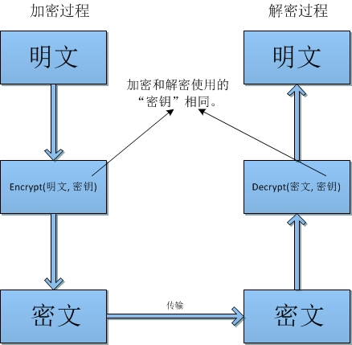

##27.1 对称加密算法

对称密码系统与编解码类似，只不过编解码基于公开的字符序列，而对称密码体系的保密则依赖于密钥的保密。通讯双方都使用同一密钥进行数据的加密和解密，对于公开的对称加密算法而言，只要能拿到密钥就可以对密文进行解密。



**对称加密算法的安全基于密钥的保密，所以密钥的安全与否决定了加密信息的安全！**

虽然说**对称加密算法**不适用于安全要求较高的场合，对是对于一般应用来说，这已经足够了。与此同时，对称加密的速度远低于非对称加密，所以还是很多场景适用对称加密。

对称加密的速度比公钥加密快很多，在很多场合都需要对称加密。

##27.2 常用对称加密算法

常用的对称加密算法如下：

###27.2.1 数据加密标准算法：DES

DES（Data Encryption Standard）是基于56位密钥的对称加密算法。然而DES已被证明不安全。不再累赘介绍！

###27.2.2 三重DES：DESede

3DES（TDEA，Triple Data Encryption Algorithm）是三重数据加密算法（TDEA，Triple Data Encryption Algorithm）块密码的通称。它是DES对称加密算法的改良版，在DES基础之上增加了密钥的长度，为原来的三倍，例如Java支持56位密钥的DES算法，则3DES的密钥则为56 * 3 = 168位。3DES骨子里还是使用的DES的算法实现。

###27.2.3 高级数据加密标准：AES

AES（Advanced Encryption Standard，高级数据加密标准）是作为DES的替代者出现的。AES无论从安全性、性能都要远优于DES和3DES。AES的密钥供长度可以是128位、192位或256位。密钥长度越大，安全性越高，而加密和解密性能则越低。

###27.2.4 国际数据加密标准：IDEA

IDEA（International Data Encryption Algorithm，国际数据加密标准）是在DES算法的基础上发展出来的，类似于三重DES。IDEA采用128位长度的密钥。目前还没有针对IDEA的有效攻击算法。IDEA算法被广泛用于电子邮件加密。

##27.3 代码示例

###27.3.1  密钥生成

在加密之前，我们先要生成加密算法对应的密钥。我们之前所说的密钥长度都是基于位元为单位的。例如128位的密钥，则该密钥占用128个位元，以一个字节八位元，128密钥占用128 / 8 = 16个字节。使用byte[]数组存放，则byte[]的长度为16。

为了方便存储和传输，我们通常使用Base64对密钥的字节组数进行编码。而ASCII编码有很多字符是不可打印的，所以不建议使用ASCII。当然你可以使用ASCII，但是很容易在存储或传输过程中丢失字节（在计算器中存储和传输没有问题，但是使用纸质就歇菜了）。当然你可以使用其他方式和编码，一般情况下都是使用Base64，约定俗成。

Java中使用`KeyGenerator`类来生成密钥。如下：

```Java
@Test
public void generateKey() throws NoSuchAlgorithmException {
	KeyGenerator keyGenerator = KeyGenerator.getInstance("AES");
	keyGenerator.init(128);
	Key key = keyGenerator.generateKey();

	System.out.println(Base64.getEncoder().encodeToString(key.getEncoded())); // MU15U/nvzHzRbvfyx+GEVg==
}
```
在这里，我们生成了AES加密算法128长度的密钥，假设生成的密钥为：`MU15U/nvzHzRbvfyx+GEVg==`，后面我们使用该密钥进行数据的加密与解密。

###27.3.2 加密

目前，我们已经有了`MU15U/nvzHzRbvfyx+GEVg==`这窜密钥，我们还根据这窜密钥生成Key对象。我们需要借助SecretkeySpec还原Key对象。

Cipher是JCA中用于加密解密的类，它同时负责数据的加密与解密。在初始化时，需要为Cipher指定是加密或是解密模式。

加密与加密的过程直接操作的是数据的字节数组，由于字符在JVM中是以unicode形式存在的，字符串的不同编码的字节数组序列是不一样的，例如UTF-8和GBK的字节序列就不一样。所以在加密之前或加密之后需要将字符编码进行编码与解码。当然，这不是必须的，你可以使用系统默认的ASCII字符编码，只要统一即可。

数据加密后是以字节数组存在的，跟密钥类似，为了方面存储和传输，我们将加密后的结果转为Base64表示形式。

```Java
@Test
public void encrypt() throws NoSuchAlgorithmException, NoSuchPaddingException, InvalidKeyException,
		IllegalBlockSizeException, BadPaddingException {
	byte[] keyBytes = Base64.getDecoder().decode("MU15U/nvzHzRbvfyx+GEVg=="); // 根据密钥的Base64表示生产密钥的字节数组

	Key key = new SecretKeySpec(keyBytes, "AES");

	Cipher cipher = Cipher.getInstance("AES"); // AES对称加密算法
	cipher.init(Cipher.ENCRYPT_MODE, key); // 加密模式

	String plaintext = "Hello AES!";
	byte[] cipherBytes = cipher.doFinal(plaintext.getBytes()); // 解密获得明文的字节数组
	String ciphertext = Base64.getEncoder().encodeToString(cipherBytes); // 生成密文的Base64表示

	System.out.println(ciphertext); // PGw0tz7XKpSP+h5EOjJALQ==
}
```

加密结果为：PGw0tz7XKpSP+h5EOjJALQ==，下面我们根据密文以及密钥还原明文。

###27.3.3 解密

解密过程初始化Key对象跟加密过程是一致的。与加密过程不同，我们需要将cipher初始化为解密模式`cipher.init(Cipher.DECRYPT_MODE, key)`。而加密与解密过程这里都是调用cipher的doFinal(byte[] data)方法。

```Java
@Test
public void decrypt() throws InvalidKeyException, NoSuchAlgorithmException, NoSuchPaddingException,
		IllegalBlockSizeException, BadPaddingException {
	byte[] keyBytes = Base64.getDecoder().decode("MU15U/nvzHzRbvfyx+GEVg=="); 

	Key key = new SecretKeySpec(keyBytes, "AES");

	Cipher cipher = Cipher.getInstance("AES");
	cipher.init(Cipher.DECRYPT_MODE, key); // 解密模式

	String ciphertext = "PGw0tz7XKpSP+h5EOjJALQ==";
	byte[] plainBytes = cipher.doFinal(Base64.getDecoder().decode(ciphertext.getBytes())); // 明文的字节数组
	String plaintext = new String(plainBytes); // 解码为字符串表示

	System.out.println(plaintext); // Hello AES!
}
```
加密还原明文为：Hello AES!

##27.4  参考资料
* 密码学：http://zh.wikipedia.org/wiki/%E5%AF%86%E7%A2%BC%E5%AD%B8
* 经典密码：http://zh.wikipedia.org/wiki/%E7%B6%93%E5%85%B8%E5%AF%86%E7%A2%BC
* DES：http://zh.wikipedia.org/wiki/%E8%B3%87%E6%96%99%E5%8A%A0%E5%AF%86%E6%A8%99%E6%BA%96
* 3DES：http://zh.wikipedia.org/wiki/3DES
