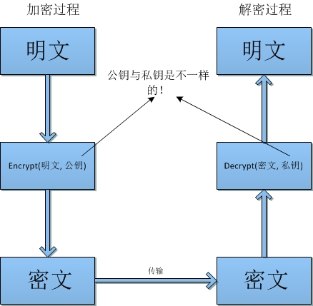

##28.1 非对称加密算法

**非对称加密算法**与**对称加密算法**的区别在于：对称加密算法加密与解密使用的密钥是相同的，而非对称加密算法的加密与解密使用的密钥是不相同的，在这两个密钥中，一个公开，成为**公钥**，一个保密，成为**私钥**。

在**非对称加密算法**中，公钥与私钥是成对存在的，公钥和私钥均可用于加密和解密。使用公钥加密的密文只有对应的私钥才能解密，而使用私钥加密的密文只有对应的公钥才能解密。用公钥加密的密文即使使用公钥本身也无法解密，私钥也同理。



##28.2 常用非对称加密算法

###28.2.1 典型非对称加密算法：RSA

RSA算法密钥的长度为512位至65535位之间，且必须是64的倍数。Java6默认的RSA算法的密钥长度是1024位。

###28.2.2 常用非对称加密算法：EIGamal

EIGamal算法密钥的长度为160位至16384位之间，且必须为8的倍数。Java没有默认对EIGamal算法的实现。如果需要使用GIGmal算法，可以使用Bouncy Castle的实现。

##28.3 代码示例
###28.3.1 密钥生成

```Java
@Test
public void t4_keyPair() throws NoSuchAlgorithmException {
	KeyPairGenerator keyPairGenerator = KeyPairGenerator.getInstance("RSA");
	keyPairGenerator.initialize(1024);
	KeyPair keyPair = keyPairGenerator.generateKeyPair();
	Key privateKey = keyPair.getPrivate();
	Key publicKey = keyPair.getPublic();

	System.out.println(Base64.getEncoder().encodeToString(privateKey.getEncoded()));
	System.out.println(Base64.getEncoder().encodeToString(publicKey.getEncoded()));
}
```

###28.3.2 加密

```Java
@Test
public void t5_encrypt() throws NoSuchAlgorithmException, NoSuchPaddingException, InvalidKeyException,
		IllegalBlockSizeException, BadPaddingException, InvalidKeySpecException {
	String publicKeyStr = "MIGfMA0GCSqGSIb3DQEBAQUAA4GNADCBiQKBgQCc7C/NuteEdublEfhTk9SJC0+ckhT6Q3KazYhDBGKkJcApJ1ovfaZxGFBYwK4OMm+MprGAcUTkRIN41w4l39vjZkFtWXnNRbz4pw7whJOGIzdJuaaxBQ9s7Ig5w4Hr4nfaGvwe0DnybrEQSg2MRVrsQgclDFJeuc+L7HUdNgGBhQIDAQAB";

	X509EncodedKeySpec keySpec = new X509EncodedKeySpec(Base64.getDecoder().decode(publicKeyStr));
	KeyFactory keyFactory = KeyFactory.getInstance("RSA");
	PublicKey publicKey = keyFactory.generatePublic(keySpec);

	Cipher cipher = Cipher.getInstance("RSA");
	cipher.init(Cipher.ENCRYPT_MODE, publicKey);
	
	byte[] cipherByetes = cipher.doFinal("Hello RSA!".getBytes());
	System.out.println(Base64.getEncoder().encodeToString(cipherByetes));
}
```

###28.3.3 解密

```Java
@Test
public void t6_decrypt() throws NoSuchAlgorithmException, InvalidKeySpecException, InvalidKeyException,
		NoSuchPaddingException, IllegalBlockSizeException, BadPaddingException {
	String privateKeyStr = "MIICdgIBADANBgkqhkiG9w0BAQEFAASCAmAwggJcAgEAAoGBAJzsL82614R25uUR+FOT1IkLT5ySFPpDcprNiEMEYqQlwCknWi99pnEYUFjArg4yb4ymsYBxROREg3jXDiXf2+NmQW1Zec1FvPinDvCEk4YjN0m5prEFD2zsiDnDgevid9oa/B7QOfJusRBKDYxFWuxCByUMUl65z4vsdR02AYGFAgMBAAECgYBQAIoOlOczfXsR5it4ULHWfJHF/SP8w042ZfrGUAIKNcTWNl3gQGsO1ZqA5RrX2hbM2l88YIMC7XsprFpmLM7pO8+DjfcVI5BklFnAe51mwVe6RuvhwMiaNH/0uwyOtwr6HurQGh0zBjEsrTeVtVqhBt7EbbtlXOSZGNib6WwugQJBAPS7fwrV33NO+x0MnnWnAH5JE0psucjgFQVyja6Z5pwtHJwxt9LYVpWj/41aC2ybWzhDNrKloznL8jZWGnvWbS0CQQCkJbuS7w2lB1mpCYwIgQ2bYUwsjRuUAMwcNg6uzx8FjRVg1zh1of2mNHyo7nJvYQfosrZiQebNkXvhUj9suIy5AkEApGp2vlPTTAdqwyhgKNCqjy0O7bg/1Ile9grwzrWMba4NA46PXfKDsQK9xDwTYsK4tQLK85g+Ia03q3OLVVlIfQJAWdjNcv+mWE5NpVi0bXM2H3aCW2BhWAGXt1lfcA+uyzsOGJO1M64XSIIyOcVKnexeh+BKND4eNycKx6pdTQU3AQJAJnsDuev8T2ItU32jq70DatKhcv5FdS6QeTRhtVLLSgQTY+HY/OJykQjb+EChyv7sPEVmbDY1xm6J2fIopXB66w==";
	String ciphertext = "d+eO80FHf1a/nMf6w14U2+IwbHcu6G57XC/yRK+9RSVYJcHKNlL1rTDEh37zXQKnZUE/ew82gdz8AnkHlCMmRCSEEJUxVwst1WAgsHdtn3Dfe8u71AZdbv+ujVTBBoOL6bhrTJERFU856vISA5bw1FRi6gA0VHi/MB+ag2MpXy8=";

	PKCS8EncodedKeySpec keySpec = new PKCS8EncodedKeySpec(Base64.getDecoder().decode(privateKeyStr));
	KeyFactory keyFactory = KeyFactory.getInstance("RSA");
	PrivateKey privateKey = keyFactory.generatePrivate(keySpec);

	Cipher cipher = Cipher.getInstance("RSA");
	cipher.init(Cipher.DECRYPT_MODE, privateKey);

	byte[] plainBytes = cipher.doFinal(Base64.getDecoder().decode(ciphertext.getBytes()));
	System.out.println(new String(plainBytes));
}
```

##28.4 参考资料 
