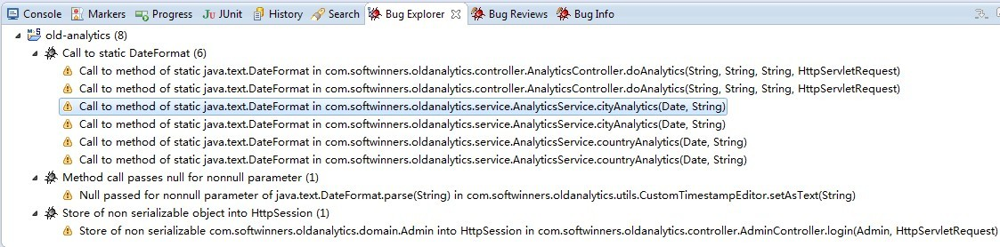

#01.工具篇

  作为一个Java屌丝，如何编写高质量的Java代码，不仅考验屌丝个人扎实的基本功，良好的编码习惯，还得实用各式各样的工具来提升
  自身编码的过程与质量，这里列举一些提升Java代码质量的常用工具。
  
##1.FindBugs静态代码分析
  FindBugs是一个静态分析工具，使用它可以在编码和维护阶段，查找和分析代码潜在的缺陷，快速帮助开发人员修补系统潜在的BUG。
  是一款加班编码找BUG之必备良药。
  
  安装的步骤也很简单，Elipse -> Help -> Eclipse Marketplace -> 输入FindBugs 点击查找，再安装步骤安装就大功告成啦！安装完成后，右击项目或文件 -> Find Bugs -> Find Bugs 就罗列代码潜在的BUG了。
  
  为了获得详细信息和建议，打开Bug Explorer和Bug Info视图即可，也可以将FindBugs集成到Ant或Maven中，以便在编译阶段执行FindBgus，具体内容请Google，你懂的！

  
  
##2.Junit单元测试工具
  
  JUnit是由 Erich Gamma 和 Kent Beck 编写的一个回归测试框架（regression testing framework）。Junit测试是程序员测试，即所谓白盒测试，因为程序员知道被测试的软件如何（How）完成功能和完成什么样（What）的功能。Junit是一套框架，继承TestCase类，就可以用Junit进行自动测试了。

  <a href="http://junit.org/">Junit官网</a>
  
  <a href="http://www.asjava.com/junit/junit-tutorials-and-example/">junit-tutorials-and-example</a>

##3.Selenium

  Selenium也是一个用于Web应用程序测试的工具。Selenium测试直接运行在浏览器中，就像真正的用户在操作一样。支持的浏览器包括IE、Mozilla Firefox、Mozilla Suite等。这个工具的主要功能包括：测试与浏览器的兼容性——测试你的应用程序看是否能够很好得工作在不同浏览器和操作系统之上。测试系统功能——创建衰退测试检验软件功能和用户需求。支持自动录制动作和自动生成。Net、Java、Perl等不同语言的测试脚本。Selenium 是ThoughtWorks专门为Web应用程序编写的一个验收测试工具。
  
  <a href="http://docs.seleniumhq.org/">Selenium官网</a>
  
  <a href="http://baike.baidu.com/view/478050.htm">百度百科介绍</a>
